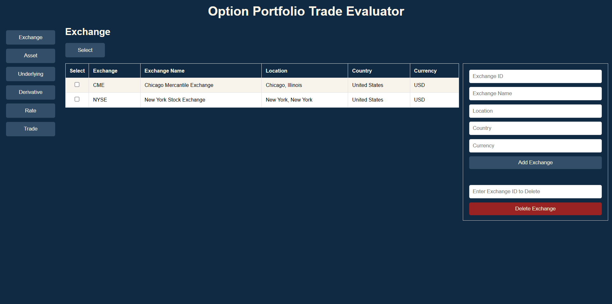
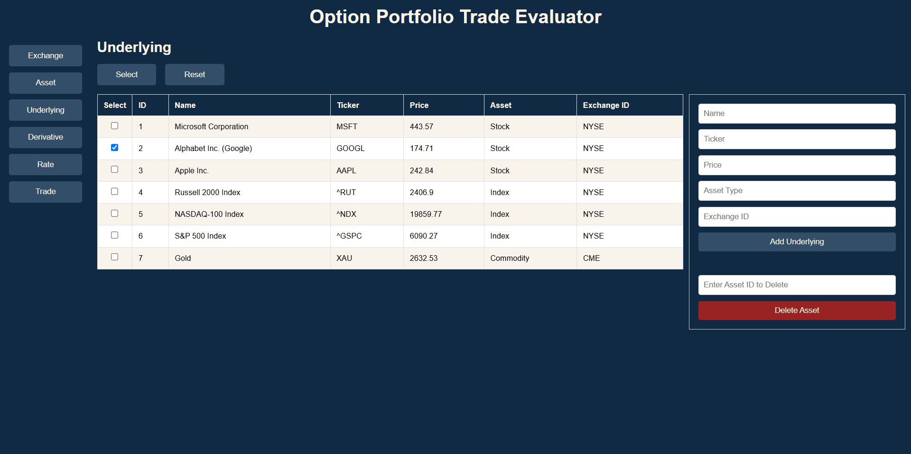

# Portfolio Trade Evaluation Web Application

- [Overview](#overview)
- [Features](#features)
- [Technology Stack](#technology-stack)
- [Future Enhancements](#future-enhancements)

## Overview
This web application provides a comprehensive solution for portfolio trade evaluation. It uses Entity Framework Code First for database management and Monte Carlo simulations to help users assess portfolio performance.

## Features

  - **Database Integration**: Seamless connection with a PostgreSQL database using Entity Framework Code First.
  - **Checkbox Filtering**: Allows users to filter data using checkboxes, with an option to reset filters.
    
  - **Right-side Field Management**: Enables users to directly add and delete data from fields.
  - **Derivatives Page Integration**: Allows users to add options from the derivatives page to their portfolio.
  - **Trade Page Evaluation**: Provides a comprehensive view of the user's portfolio, with an `Evaluate` button to obtain detailed evaluations.

## Technology Stack

  - **Backend**: C#, ASP.NET Core, Entity Framework
  - **Frontend**: HTML, CSS, JavaScript
  - **Database**: PostgreSQL
  - **Core Algorithm**: Monte Carlo simulation

## Future Enhancements

  - Add historical stock price and interest rate time series.
  - Integrate visual plots for better data visualization.
  - Automatically populate corresponding stock prices and interest rates when a trade is selected.
